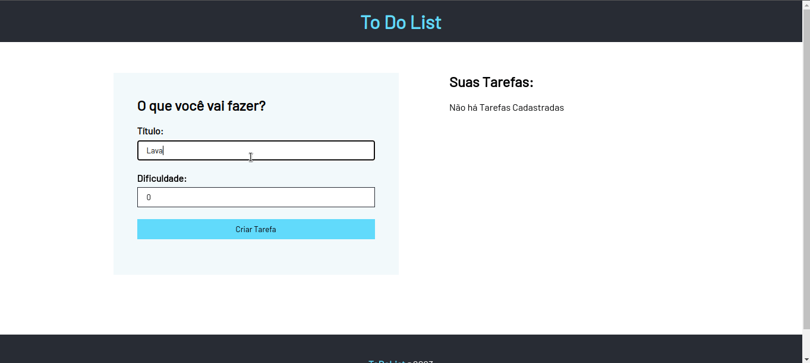
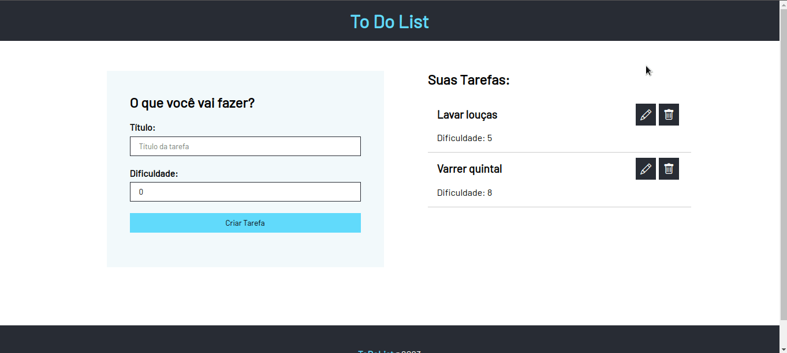
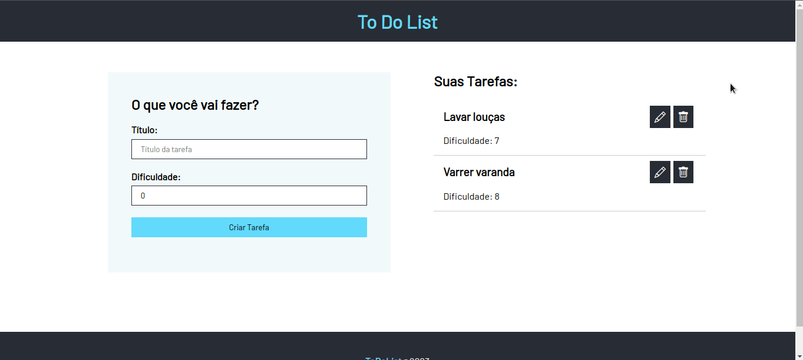

# To Do List

Este projeto foi realizado durante o curso de React, intruido pelo <a href="https://www.udemy.com/user/matheus-battisti/">Matheus Battisti</a>. Trata-se de uma lista de tarefas, onde é possível definir a tarefa e o grau de dificuldade da mesma. Esta aplicação foi desenvolvida em React + TypeScript e é possível fazer CRUD(create, read, update and delete) das tarefas.

    <h5>Create and Read</h5>
    

    <h5>Update</h5>
    

    <h5>Delete</h5>
    

Para baixar as dependências do projeto utilize o comando abaixo:

##### `npm install` 

Para rodar o projeto utilize o comando abaixo:

##### `npm start`

